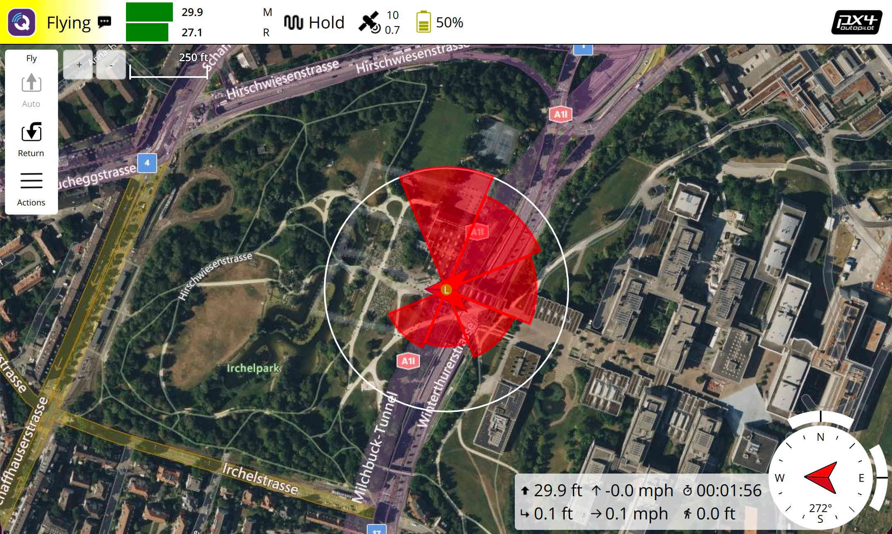

# TagTracker

TagTracker is a custom [QGroundControl](https://github.com/mavlink/qgroundcontrol) build for **wildlife radio-tag tracking from drones**. It extends QGC with specialized UI, state machines, and a tunnel protocol to communicate with an onboard companion computer running SDR (Software Defined Radio) hardware for detecting VHF radio-tag pulses from wildlife tags.



## How It Works

1. Tag definitions (frequency, pulse timing) are uploaded to an onboard companion computer via MAVLink tunnel messages.
2. The companion computer starts SDR-based pulse detection using an Airspy receiver.
3. The drone rotates in place at a configurable altitude, divided into angular slices (8 or 16).
4. Pulse signal strength (SNR) data is collected at each heading slice and streamed back to the GCS.
5. Detected pulses are visualized on the map as color-coded markers and directional pulse-rose diagrams.
6. All pulse data is logged to CSV for post-processing and bearing calculation.

## Operations

TagTracker provides the following operations via the fly-view actions toolstrip:

| Action | Description |
|---|---|
| **Auto Detection** | One-button operation: takeoff, start detection, rotate, stop detection, RTL. Available when the vehicle is not flying. |
| **Start Detection** | Upload tags to the controller and start pulse detection. |
| **Stop Detection** | Stop all pulse detection on the controller. |
| **Rotate** | Perform an in-place rotation capture while already airborne. |
| **Airspy Capture** | Capture raw SDR data from the Airspy receiver. |
| **Save Logs (SD Card)** | Save companion computer logs to the vehicle SD card. |
| **Clear Logs** | Clear companion computer logs. |
| **Download Logs (WiFi)** | Copy companion computer logs over WiFi to the QGC log save path. macOS only; requires one-time SSH key setup (see [Downloading Companion Logs](#downloading-companion-logs-macos)). |
| **Pair Telemetry Logs** | Copy each flight's telemetry log into its log folder where that has not happened yet (see [CSV Logging](#csv-logging)). |
| **Clear Map** | Remove all pulse map items and reset the SNR range. |
| **Capture Screen** | Screenshot the GCS display. |

## Detection Modes

| Mode | Description |
|---|---|
| **uavrt_detection** | C++ detector. Detection runs continuously during rotation. Uses rate-detector heartbeat gating to determine when enough data has been collected per slice. |
| **Python K=5** | Python-based detector. Detection is started and stopped per slice. Waits for a confirmed pulse or no-pulse result from all detectors before advancing to the next slice. |

## Rotation Types

| Type | Description |
|---|---|
| **Full** | Visits every slice sequentially around the full 360 degrees. |
| **Fast (Smart)** | Adaptive multi-phase strategy: initial four-point sampling, then focuses around the strongest quadrant to find the peak more quickly. |

Python detection mode uses full rotation only.

## Map Visualization

- **Pulse markers**: Color-coded circles at each pulse detection coordinate. Color gradient from navy (weak) through green to red (strong) based on relative SNR. Directional antenna mode adds a heading indicator showing the antenna direction.
- **Pulse rose**: A compass-rose overlay centered at the rotation location. Each slice is a pie wedge whose radius scales with the max SNR for that slice relative to the rotation's overall max. Updates in real-time during rotation.
- **SNR gradient legend**: A vertical scale bar on the fly view showing the SNR color mapping and value range.

## Controller Communication

Communication with the onboard companion computer uses MAVLink TUNNEL messages carrying a custom binary protocol. Commands include:

- **Tag management**: `START_TAGS`, `TAG`, `END_TAGS` — upload tag definitions
- **Detection control**: `START_DETECTION`, `STOP_DETECTION` — start/stop SDR detection
- **Data**: `PULSE` — detected pulse info streamed from controller to GCS
- **Heartbeat**: Status and CPU temperature from the MavlinkController and Channelizer
- **Utility**: `RAW_CAPTURE`, `SAVE_LOGS`, `CLEAN_LOGS`

The toolbar indicator shows real-time controller status: connection state, per-tag signal strength bars with color-coded freshness (green = active, yellow = stale, red = heartbeat lost), and a "Controller Lost" warning when heartbeats stop.

## Settings

| Setting | Description |
|---|---|
| Altitude For Rotation | Takeoff altitude for auto-detection |
| Detector K Value | Number of pulses to integrate for detection |
| Rotation Wait For K Groups | How many K-groups to wait per slice |
| Detector False Alarm Probability | Detection threshold |
| Rotation Divisions | Number of slices: 8 (45 deg) or 16 (22.5 deg) |
| Sensitivity Gain | Airspy SDR gain (1–21) |
| Show Pulse On Map | Display individual detected pulses as map markers |
| Pulse Strength Value | Use SNR or STFT Score for display |
| Maximum Pulse Value | Max value for pulse strength bar indicator |
| Antenna Rotation Offset | Offset of directional antenna from vehicle heading |
| Auto Takeoff/Rotate/RTL | Enable one-button auto operation (directional only) |
| Allow Multi Tag Detection | Allow selecting multiple tags simultaneously |
| Rotation Type | Full or Fast (smart/adaptive) |
| Antenna Type | Omnidirectional or Directional |
| Detection Mode | uavrt_detection (C++) or Python K=5 |

## Tag Database

Tags are defined with a frequency, manufacturer, and selection state. Each manufacturer specifies pulse timing parameters (intra-pulse intervals, pulse width, uncertainty, jitter). The tag database computes channelizer channel assignments for multi-tag SDR channelization.

Tags can be added, edited, and deleted through the GCS UI. At least one tag must be selected before starting detection.

## CSV Logging

Logs are grouped by vehicle connection. The first pulse or rotation log after a vehicle connects creates a folder in the QGC log save path named for that log's timestamp (`Logs/{timestamp}/`, local time), and every log from that connection goes into it until the vehicle disconnects.

- **Full pulse log** (`Pulse-{timestamp}.csv`): Every confirmed pulse from one Start Detection to the matching Stop Detection, including rotation start/stop markers with GPS coordinates.
- **Pulse log sidecar** (`Pulse-{timestamp}.json`): Written beside each full pulse log. Holds `start_utc` and `stop_utc` for the detection run, `vehicle_id` (MAVLink system ID), `app_version`, and `telemetry_file`, which stays null until the connection's telemetry log has been copied into the folder.
- **Rotation pulse log** (`Rotation-{N}.csv`): Per-rotation log files for bearing calculation input. Numbering starts at 1 in each folder.
- **Telemetry log** (`{date} {time}.tlog`): When the vehicle disconnects, or TagTracker is quit while it is still connected, the telemetry log QGC saved for that connection is copied into the folder and named in each sidecar. The copy is chosen by the timestamps recorded inside the file, not by its name, which is the time the recording stopped. The original stays in the telemetry save path. QGC saves a telemetry log only if the vehicle armed during the connection (unless "Save logs even if vehicle was not armed" is set), so a bench test leaves the folder without one.

The same pairing runs at every startup, and on demand from **Pair Telemetry Logs**, so a folder left without its telemetry log (for example after a crash, when QGC recovers the recording at the next start) is completed later. Folders that do not hold pulse log sidecars, such as downloaded companion logs, are left alone.

## Downloading Companion Logs (macOS)

The **Download Logs (WiFi)** action copies the companion computer's log folders (`~/Logs/Logs-<Type>-<timestamp>/`) over WiFi into the QGC log save path (Application Settings → Save Path). It runs `scp` under the hood and is available on macOS only. The downloaded folders sit beside TagTracker's own per-connection log folders; the companion computer names them in UTC, while TagTracker's folders use local time.

Requirements:

- The Mac and the Raspberry Pi are on the same WiFi network and the Pi is reachable as `raspberrypi.local`.
- Key-based SSH login to `pi@raspberrypi.local` is set up, using a key **without a passphrase**. The download runs non-interactively and cannot prompt for a password or passphrase.

One-time SSH key setup (run in Terminal on the Mac):

```bash
# Create a key only if you don't already have one.
# Press Enter for an empty passphrase so the download can run without prompting.
[ -f ~/.ssh/id_ed25519 ] || ssh-keygen -t ed25519

# Installs your public key on the Pi; enter the Pi password when prompted
ssh-copy-id pi@raspberrypi.local

# Verify: should return immediately with no password or passphrase prompt
ssh pi@raspberrypi.local true
```

If you already had a key and the verify step asks for a passphrase, remove it with `ssh-keygen -p -f ~/.ssh/id_ed25519` (enter the current passphrase, then press Enter twice for an empty one).

No changes are needed on the Pi beyond what `ssh-copy-id` does. If the download reports "Permission denied", the key is not installed on the Pi or still has a passphrase.

After reimaging the Pi's SD card, the Pi gets a new host key and the download fails with "HOST IDENTIFICATION HAS CHANGED". Reset it and reinstall your key:

```bash
ssh-keygen -R raspberrypi.local
ssh-copy-id pi@raspberrypi.local
```

## Building

TagTracker is built using the [QGroundControl custom build mechanism](https://dev.qgroundcontrol.com/en/custom_build/custom_build.html). The `custom/` directory contains all TagTracker-specific source code, QML, settings, and resource overrides.

### Prerequisites

Follow the [QGC build instructions](https://dev.qgroundcontrol.com/en/getting_started/) for your platform (Qt 6, CMake).

### Build

```bash
cmake -B build -G Ninja -DCMAKE_BUILD_TYPE=Debug
cmake --build build
```

### Android / Herelink

Android builds define `TAG_TRACKER_HERELINK_BUILD` for Herelink controller integration, extending `HerelinkCorePlugin` for hardware button support.

## Architecture

All multi-step operations are implemented as Qt State Machines (`CustomStateMachine` extending `QStateMachine`) composed from reusable state classes:

- **SendTunnelCommandState** — send a tunnel command and wait for ACK
- **SendTagsState** — upload tag definitions
- **TakeoffState** — takeoff to configured altitude
- **SetFlightModeState** — change flight mode (e.g., RTL)
- **CaptureAtSliceState / PythonCaptureAtSliceState** — per-slice rotation and capture
- **FullRotateAndCaptureState / SmartRotateAndCaptureState / PythonRotateAndCaptureState** — full rotation sequences
- **StartDetectionState / StopDetectionState** — detection lifecycle with optional tunnel command

State machines support `CancelOnFlightModeChange` (cancel if the pilot manually changes flight mode) and `RTLOnError` (return to launch on failure). A `registerStopHandler` mechanism allows cleanup callbacks on error or cancellation.

## License

This project is licensed under the same terms as QGroundControl. See [COPYING.md](.github/COPYING.md) for details.
