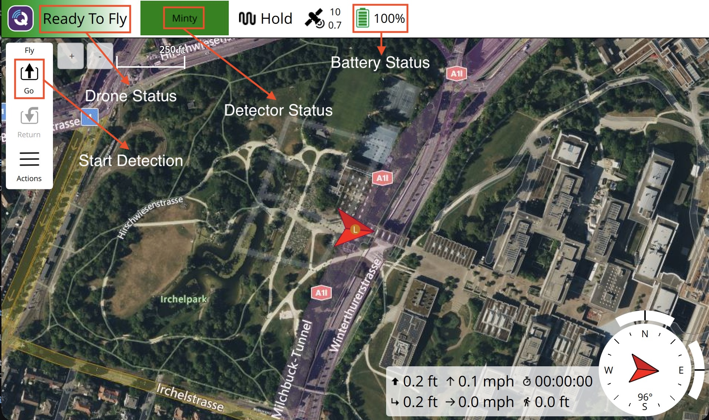
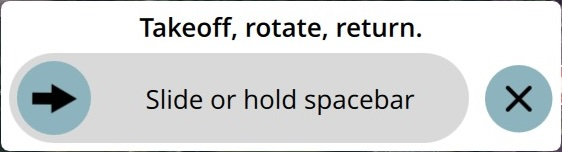
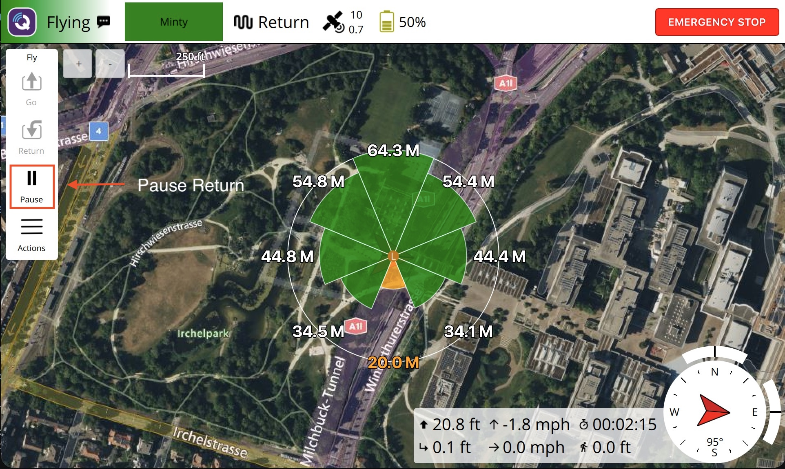

### Powering On Controller

To turn the controller on, press the power button once. Then press again and hold down till you see the logo. Open the **Tag Tracker** app.

### Main Screen

* Drone Status - Green Ready To Fly means the drone is ready to takeoff
* Detector Status - Green means ready. Also shows you which collar you are tracking.
* Battery Status - Percent remaining of battery.
* Start Detection - Pressing go will start the detection process.

### Selecting Collar To Track

Tap the Detector Status control and it will show you the list of collars to select from.

### Starting a Detection Flight

1. Make sure both the Drone Status and Detector Status are green
1. Tap the **Go** button
1. A confirmation slider will display. Slide it to the right with your finger to confirm or tap the **X** to abort.

After you confirm, the vehicle will:

1. Take off straight up to the maximum altitude.
1. Rotate a full 360° in place, showing you detected pulses at each heading.
1. When it has completed all headings it will come back down to land.
1. If you touch the control sticks during this process the detection will be cancelled and you will have to **Return** manually.

##### Cancelling a Detection

To cancel a detection and have the drone return to land. Touch the **Return** button and confirm. You may want to do this if:

* You see a plane coming flying low in your direction
* The drone seems to be acting oddly

##### Emergency Stop

If at any time you have lost control of the drone and it isn't responding to your commands you can select Emergency Stop. If you confirm the action this will stop the motors on the drone. If it is flying it will crash! This is for emergencies only where there is nothing left to do and safety is a concern.

### Reading the Display

Once the vehicle has landed, the map shows all detected pulse locations. In this example the strongest signal strength is directly north. So that is where the dogs are.

If the heading pie slice is colored green this means there is high confidence this is a good signal. If the pie slice is orange it means there is low confidence on this detection. It may be a false positive. For no detection the slice will be empty.
