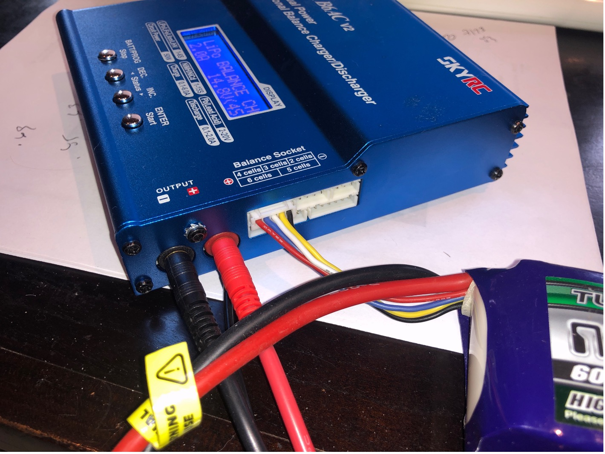
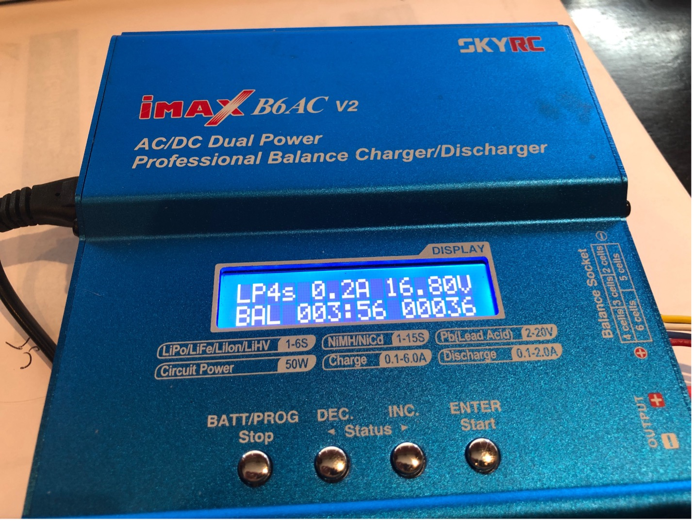

# Charging

You need to make sure both the drone batteries and the controller are fully charged before use.

## Controller

Power off the controller. On the bottom of the controller is a USB port. Connect that to the charging cable and wall outlet. It works just like charging a phone. If you press the power button while charging it will show you the charge state.

## Drone Batteries

### Connecting the Battery

1. Plug the charger into a wall outlet using the included AC power cable.
1. The battery connections are on the right side of he charger.
1. Connect the battery's **main power lead** to the charger **OUTPUT** ports. Match red to red (+) and black to black (-).
1. Connect the battery's **balance lead** (the smaller white connector with multiple wires) to the **6 cells** connector on the **Balance Socket**.

{ width=400px }

### Starting a Charge

1. Press and hold **Start/Enter** to begin charging (right-most button). The charger beeps to confirm.
2. The screen shows the charging progress including voltage, current, charge time, and capacity charged.

{ width=400px }

### When Charging Is Complete

The charger beeps continuously when the battery is fully charged. Disconnect the battery promptly:

1. Unplug the **balance lead** from the charger.
2. Disconnect the **main power lead** from the charger output ports.

### Safety

- Place the battery in the **LiPo Safe bag** during charging.
- Charge on a non-flammable surface.
- If the battery feels hot or swollen, stop charging immediately and disconnect it.
- Do not change the charger settings — they are pre-configured for the correct battery.
